"# Toothpaste-dispenser" 
# Assistive Toothpaste Dispenser — SolidWorks Design & FEA

A crank-driven, gear-and-roller toothpaste dispenser designed for users with limited motor function and digit control, who cannot generate the pinch force or wrist rotation a standard toothpaste tube requires. The device is fully mechanical, operable with one hand, and dispenses a consistent amount of paste per turn of the crank.

This repository documents the CAD build: part modelling, assembly, mass properties, and static stress analysis, all done in **SOLIDWORKS**.

<p align="center">
  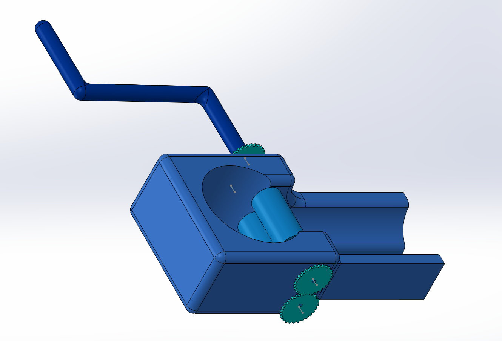
</p>

---

## Contents

- [Design Problem](#design-problem)
- [How It Works](#how-it-works)
- [SolidWorks Build](#solidworks-build)
- [Assembly Structure](#assembly-structure)
- [Material](#material)
- [Mass Properties](#mass-properties)
- [Stress Analysis (FEA)](#stress-analysis-fea)
- [Design Iteration](#design-iteration)
- [Skills Demonstrated](#skills-demonstrated)
- [Repository Structure](#repository-structure)
- [Future Work](#future-work)
- [Project Context](#project-context)

---

## Design Problem

The dispenser was developed for a stakeholder with restricted hand mobility. Interviews and a needs analysis produced five hard requirements that drove every geometry decision:

| Requirement | Design implication |
|---|---|
| Operable without finger or wrist function | Extended crank arm — gross arm motion only, no pinch grip |
| One-handed operation | Free-standing body with a wide, flat, friction-based footprint; the other hand stays free to catch the paste |
| Consistent, controlled dose | Positive gear engagement so paste output is proportional to crank rotation |
| Small footprint | Compact horizontal envelope that fits a small bathroom counter |
| Low operating force, fast dispensing | Gear ratio chosen to trade rotation for torque at the rollers |
| Durable under daily use | Solid-walled body, filleted stress risers, 3D-printable in one piece |

---

## How It Works

Turning the crank drives a spur gear train, which rotates a pair of opposed rollers. The rollers pinch the toothpaste tube between them and progressively drive paste toward the nozzle. Because the crank arm is long relative to the roller radius, the user supplies low force over a large arc instead of high force over a short pinch — the mechanical advantage does the work.

The tube seats in the circular pocket in the body; the extruded channel on the right guides and supports it as it feeds through.

<p align="center">
  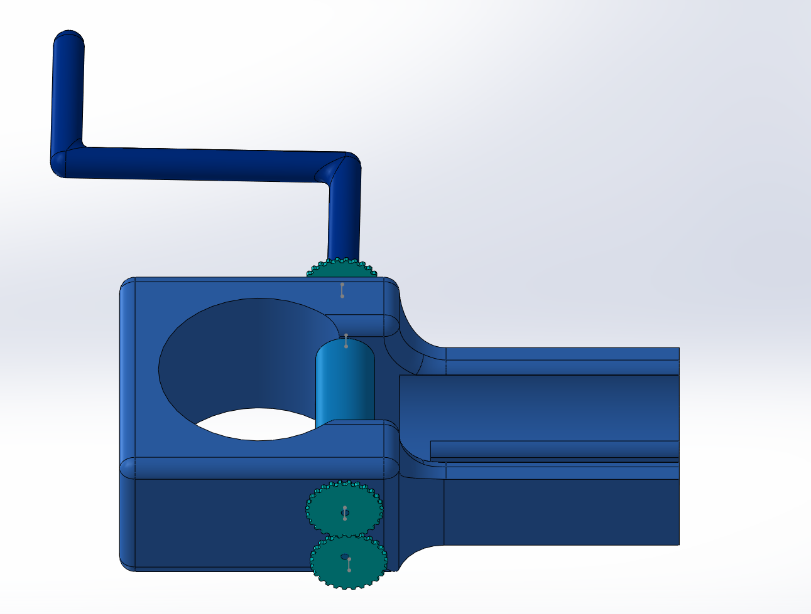
  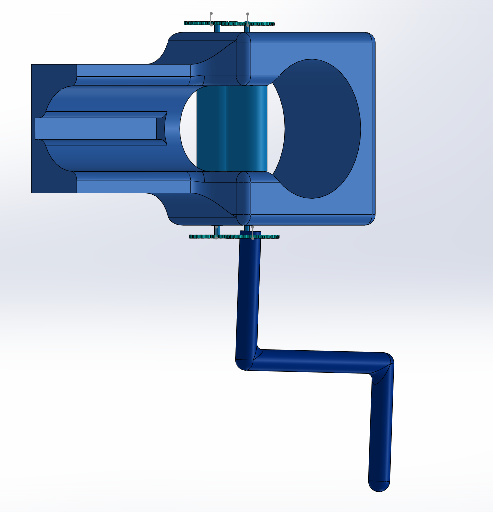
</p>

---

## SolidWorks Build

Each component was modelled as a separate part file and brought together in an assembly with mates driving the gear and roller rotation.

<table>
<tr>
<td width="45%" align="center">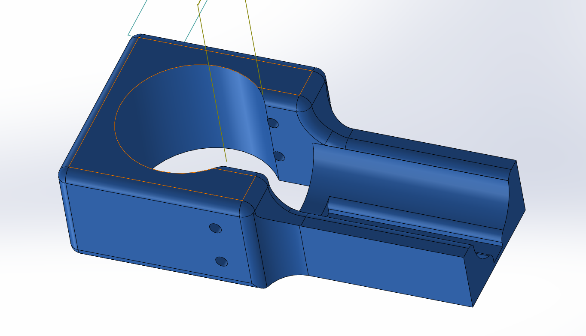</td>
<td width="55%">

**Body** — the structural chassis of the device.

Modelled from a single `Boss-Extrude`, then hollowed and shaped with seven `Cut-Extrude` features to create the tube pocket, roller cavity, gear clearances and axle bores. Six `Fillet` features round the external edges and internal corners for both grip comfort and print strength.

</td>
</tr>
<tr>
<td align="center">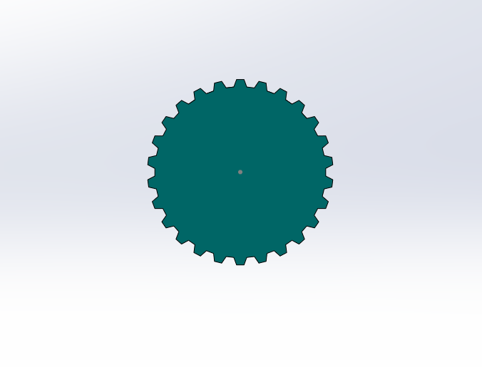</td>
<td>

**Spur gear** — built from two `Boss-Extrude` features (hub and web) with a single tooth profile sketched and driven around the pitch circle by a `Circular Pattern` (`CirPattern1`). Editing one sketch updates every tooth, so the tooth count and ratio stay parametric.

</td>
</tr>
<tr>
<td align="center">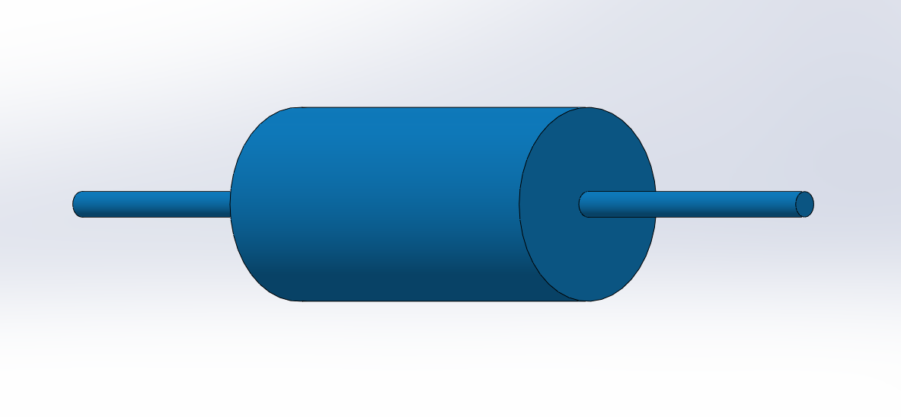</td>
<td>

**Roller** — three concentric `Boss-Extrude` features producing the squeezing barrel and its two stub axles in one solid body. Two instances mate into the body cavity.

</td>
</tr>
<tr>
<td align="center">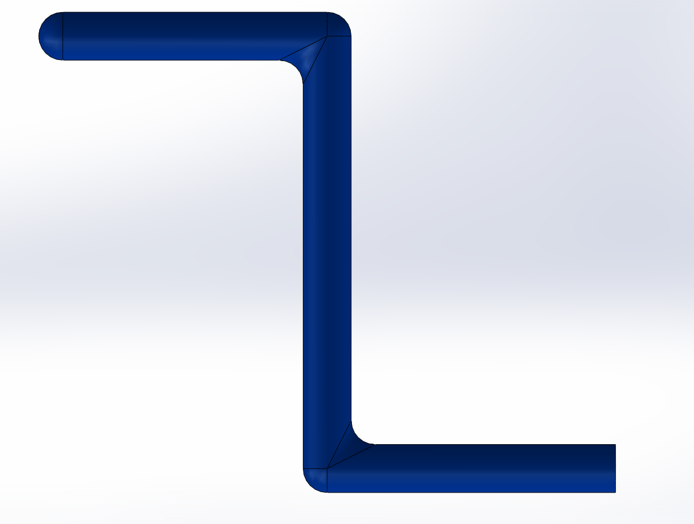</td>
<td>

**Crank** — a `Swept Boss/Base` (`Sweep1`): a circular profile swept along a 3D path to produce the offset handle in one continuous feature, finished with a `Fillet` at the bends. The offset sets the moment arm and therefore the input torque.

</td>
</tr>
</table>

---

## Assembly Structure

The top-level assembly contains eight components — four gears, two rollers, the body, and the swept crank — constrained with mates so the gear train and rollers rotate together.

<p align="center">
  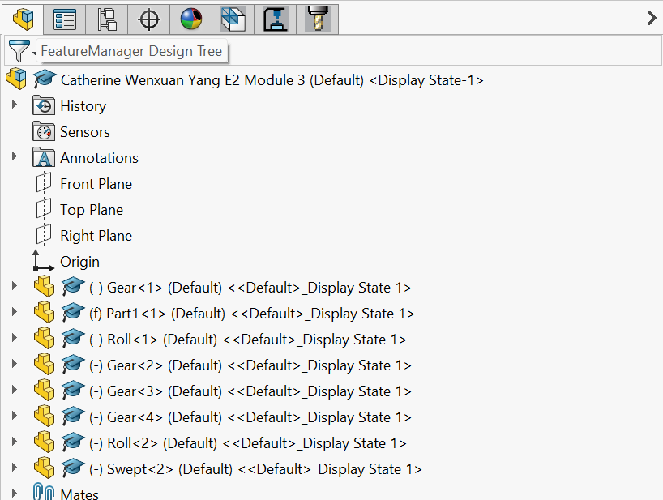
  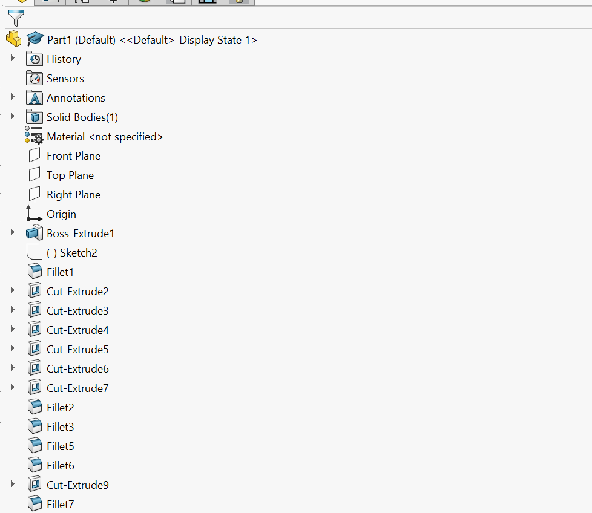
</p>

*Left: assembly design tree. Right: feature tree of the body part.*

---

## Material

**Nylon 101**, selected for:

- **Yield strength of 60 MPa** — ample margin for the loads seen in service (see FEA below)
- **Printability** — the whole assembly can be rapid-prototyped on an FDM printer, so iterations are cheap and fast
- **Wear resistance and low friction** — suitable for rolling contact and repeated daily use
- **Moisture tolerance** — appropriate for a bathroom counter environment

---

## Mass Properties

Evaluated in SolidWorks on the assembly as modelled:

| Property | Value |
|---|---|
| Mass | 3139.99 g |
| Volume | 2,730,430.18 mm³ |
| Surface area | 286,543.37 mm² |
| Centre of mass (X, Y, Z) | 204.42, −9.80, 52.92 mm |

<p align="center">
  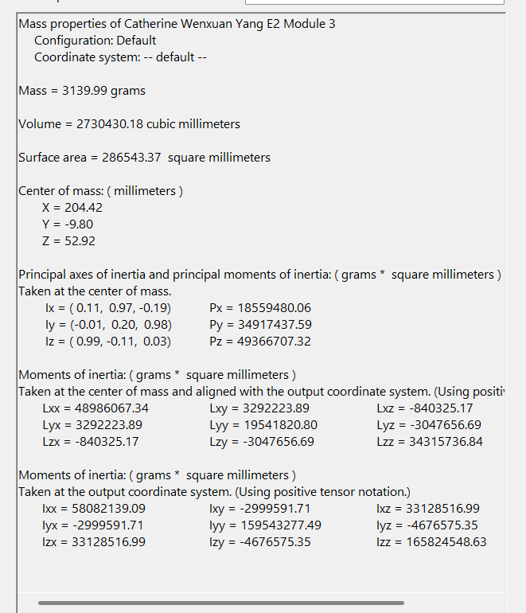
</p>

The low, forward centre of mass keeps the device stable on the counter while the crank is turned — the dispenser does not need to be held down with the second hand.

---

## Stress Analysis (FEA)

A static study was run in **SOLIDWORKS Simulation** with the base fixed and the operating load applied at the crank, to confirm the housing survives daily use.

<p align="center">
  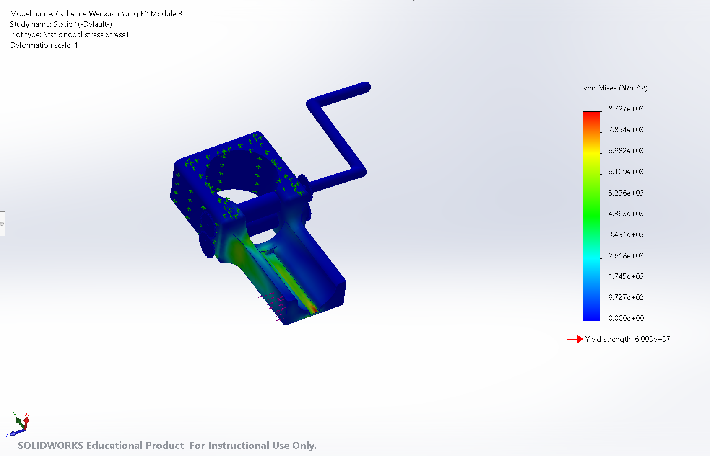
</p>

| Result | Value |
|---|---|
| Peak von Mises stress | 8,727 Pa |
| Nylon 101 yield strength | 60,000,000 Pa |
| **Factor of safety** | **> 6,800** |

Stress concentrates along the lower rib of the body, where the load path runs from the crank axis into the base — visible as the green/yellow band in the plot. Even there, peak stress is roughly four orders of magnitude below yield, so the part will not fail under hand-applied loads. The result also flags a clear opportunity: the design is heavily over-built, and material can be removed from the body without risking failure.

---

## Design Iteration

<table>
<tr>
<td align="center" width="33%">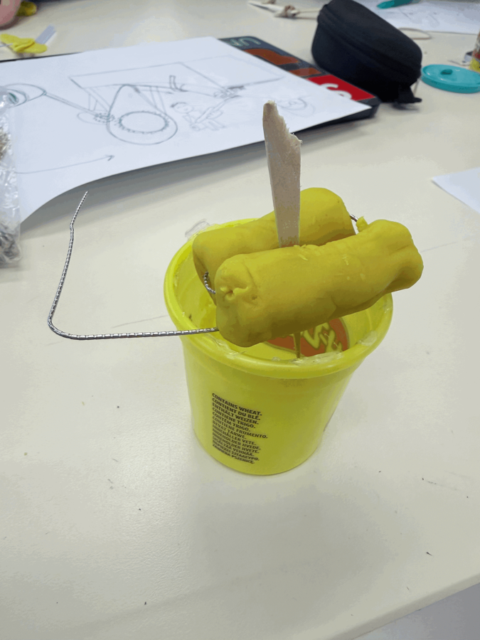<br><sub>Low-fidelity prototype used to fix rough proportions</sub></td>
<td align="center" width="33%">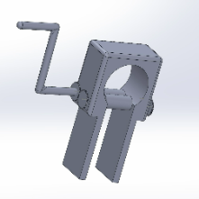<br><sub>Early CAD: strong mechanical advantage, weak stability</sub></td>
<td align="center" width="33%"><br><sub>Final CAD: horizontal layout, enclosed gear train, wide base</sub></td>
</tr>
</table>

The first CAD iteration was a vertical frame. It delivered the required mechanical advantage but was tall, tippy, and left the gears exposed. Reworking it into a low horizontal layout with a wide friction base and a partially enclosed gear train fixed the stability problem, lowered the operating height to within the user's reach, and made the device more robust — all without giving up the crank's torque advantage.

---

## Skills Demonstrated

- **Part modelling** — extrudes, cuts, fillets, swept boss/base, circular patterns
- **Parametric design** — patterned gear teeth and dimension-driven geometry that update on edit
- **Assembly modelling** — 8-component assembly with mates driving rotational motion
- **SOLIDWORKS Simulation** — static study setup, fixtures, loads, von Mises interpretation, factor-of-safety evaluation
- **Mass property analysis** — mass, volume, centre of mass, moments of inertia
- **Material selection** — matching mechanical properties and manufacturability to the application
- **Design for additive manufacturing** — single-piece printable parts, filleted internal corners
- **Requirements-driven design** — traceable path from stakeholder needs to geometry decisions

---

## Repository Structure

```
.
├── README.md
└── assets/
    ├── final-assembly-iso.png       # Final assembly, isometric
    ├── final-assembly-front.png     # Final assembly, front
    ├── final-assembly-side.png      # Final assembly, side
    ├── part-body.png                # Body part render
    ├── part-gear.png                # Spur gear render
    ├── part-roller.png              # Roller render
    ├── part-crank.png               # Crank render
    ├── feature-tree-assembly.png    # Assembly design tree
    ├── feature-tree-body.png        # Body feature tree
    ├── mass-properties.png          # Mass property output
    ├── fea-von-mises.png            # Static stress study
    ├── cad-early-iteration.png      # Earlier CAD iteration
    └── physical-prototype.png       # Low-fidelity prototype
```

---

## Future Work

- **Mass reduction** — the FEA shows a factor of safety over 6,800, so the body can be shelled or ribbed to cut weight and print time substantially
- **Physical validation** — 3D print the assembly in Nylon 101 and measure actual dispensing time and required crank force
- **User testing** — verify one-handed operation and operating height with the target user group
- **Durability testing** — cycle testing on the gear train and roller axles to confirm the design survives repeated daily use
- **Nozzle and tube retention** — refine how tubes of different sizes seat and stay aligned in the body pocket

---

## Project Context

Completed as a first-year engineering design project (APSC 100, Group E2) in a six-person team, following a full design cycle: stakeholder needs analysis → concept generation → weighted concept evaluation → CAD → analysis → recommendation. CAD, simulation, and analysis were carried out in SOLIDWORKS Educational.